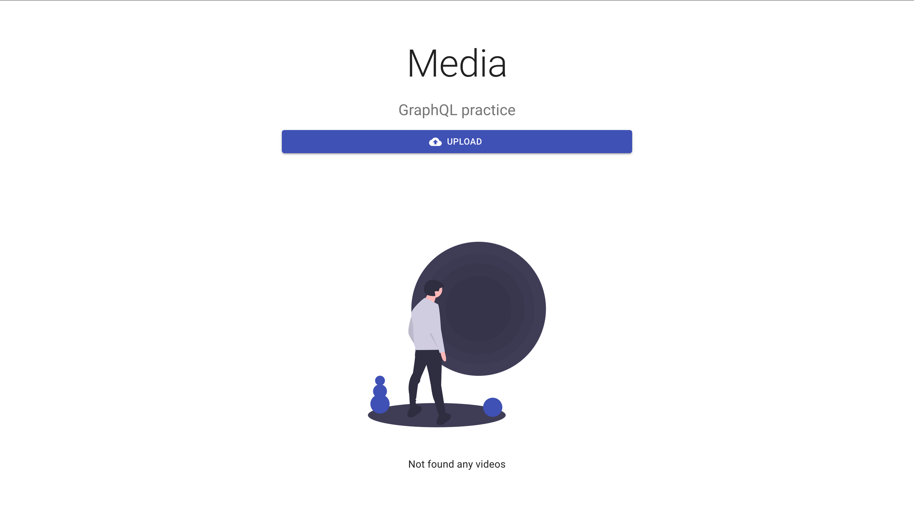
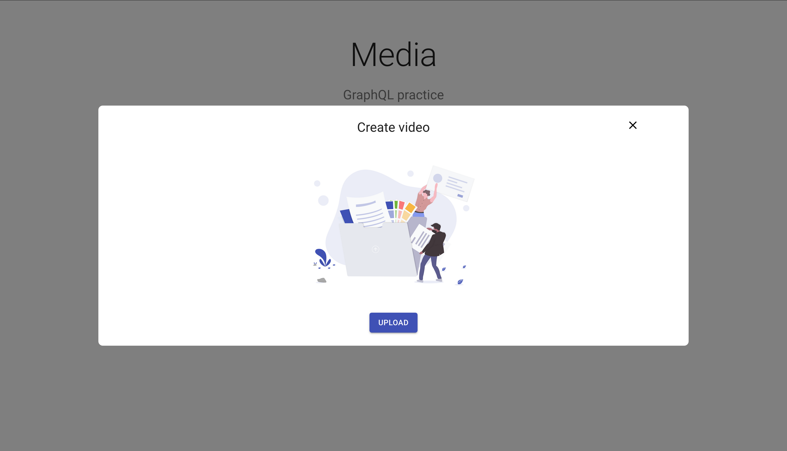
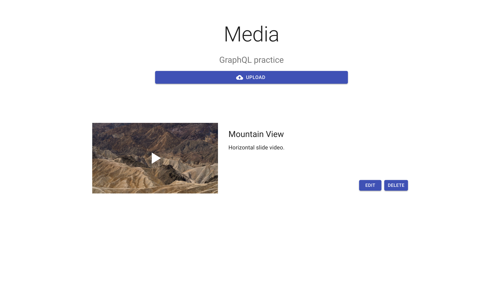
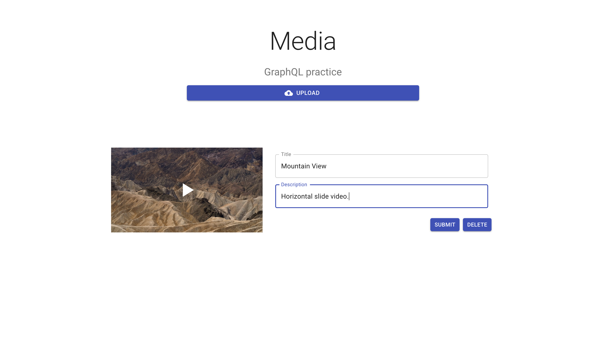

# Media

GraphQL file upload full stack practice with React and Express.

### Prerequisite

FFmpeg
Node version > 12
A MySQL server (you can run `docker-compose.db.yml`)

### Tech stack

- package system: yarn
- Front-end: React、Material UI
- Back-end: Express、Sequelize、Apollo GraphQL
- Database: MySQL

### Website

